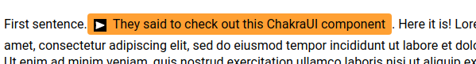

# textaudio



Text with playable audio created using Chakra UI components and Howler.js. Inspired by this [ABC article](https://www.abc.net.au/news/2021-03-26/the-base-tapes-secret-recordings-australian-recruitment/13255994). 

## Basics
Two ways to create a TextAudio component and fill it up with text. Either way will require an audioPath attribute that sources the audio clip to play. All other additional features are passed as a parameter. 
#### Parameter Text / Single Line
Text is passed in as a parameter of the TextAudio component.
```ts
<TextAudio
  audioPath="./audio-file.mp3"
  text={
    'Here are some words'
  }
/>
```

#### Child Text
Text is passed in as a parameter of the TextAudio component.
```ts
<TextAudio
  audioPath="./audio-file.mp3"
>
  Here are some words
</TextAudio>
```

## Parameters


# Credits / Attributions

[Play Button](https://game-icons.net/1x1/guard13007/play-button.html) by Guard13007 under [CC BY 3.0](https://creativecommons.org/licenses/by/3.0/)

[Pause Button](https://game-icons.net/1x1/guard13007/pause-button.html) by Guard13007 under [CC BY 3.0](https://creativecommons.org/licenses/by/3.0/)

[Test Audio](https://opengameart.org/content/crystal-cave-song18) by cynicmusic under [CC0 1.0](https://creativecommons.org/publicdomain/zero/1.0/)

[Julia Gillard Speech](https://www.youtube.com/watch?v=ihd7ofrwQX0)

[Tony Abbott Comment](https://www.youtube.com/watch?v=z_qW7Oo4Z-I)
